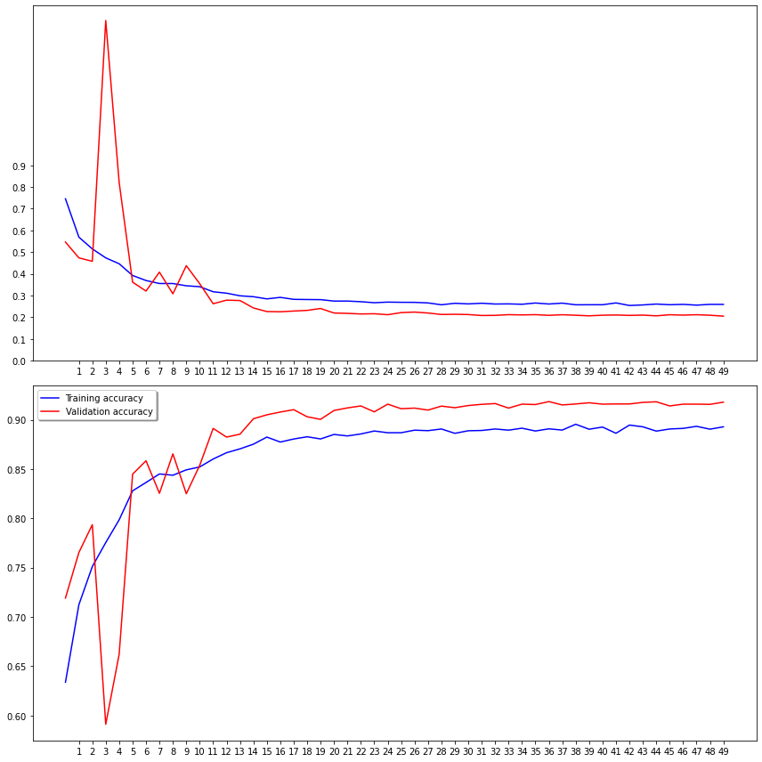
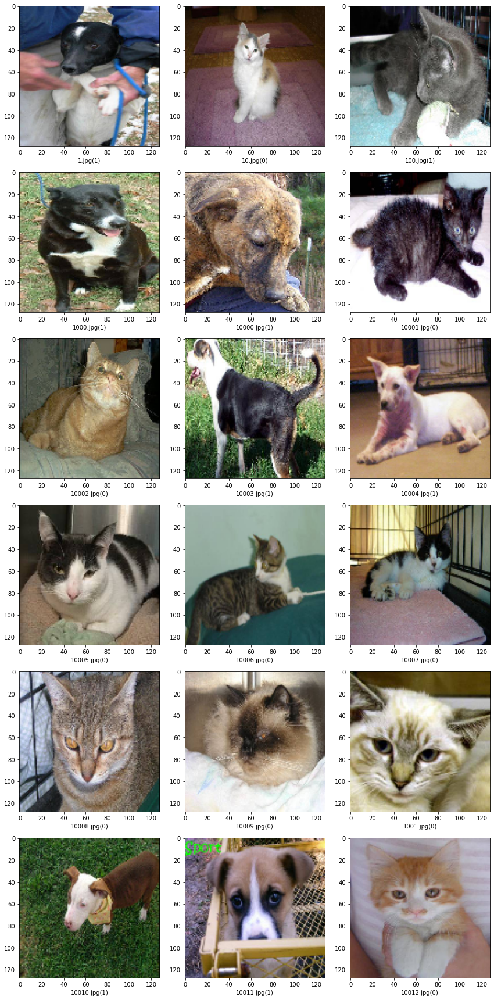

# Week 4

## Running Project

### Running on Kaggle (Suggested)

1. Sign-In or create an account on Kaggle (Required)
2. Go to <https://www.kaggle.com/kyledampier/ml-monday-week-4>
   - Forked from: <https://www.kaggle.com/uysimty/keras-cnn-dog-or-cat-classification/data>
3. At the top right of the website, copy this notebook
4. Unzip the files using python zip library and change where files are being accessed as running.
5. You're all ready

### Running Locally

1. Download files from Kaggle <https://www.kaggle.com/uysimty/keras-cnn-dog-or-cat-classification/data>
2. Copy and unzip files in Resources/Lectures/Data
3. Open and step through Week4.ipynb

## Model Preformance

### Training Accuracy and Loss Over 50 Epochs

Loss = Top | Accuracy = Bottom

### Example Predictions From model

0 = cat, 1 = dog

